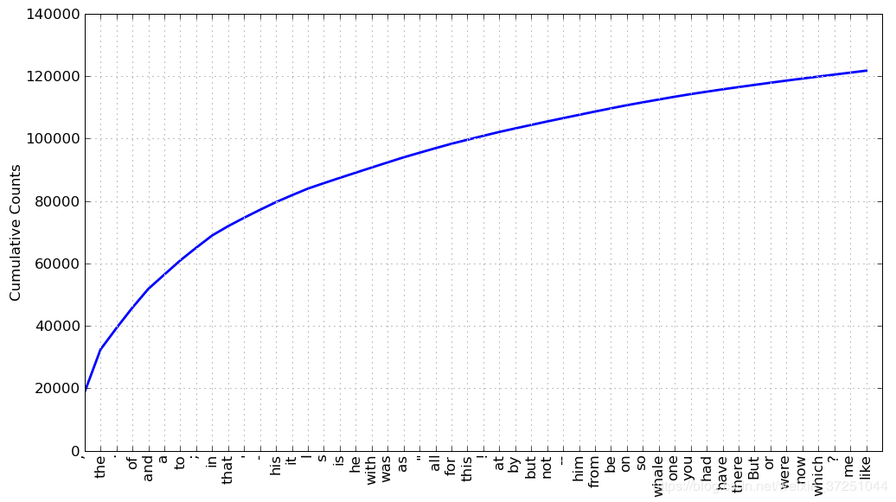

原书：《Python自然语言处理》：https://usyiyi.github.io/nlp-py-2e-zh/
#  语言处理与Python
原文：https://usyiyi.github.io/nlp-py-2e-zh/1.html
# 1.NLTK入门
## 1.NKLT的安装，nltk.book的安装
## 2.搜索文本
```py
text1.concordance("monstrous") # 搜索文本text1中含有“monstrous”的句子
text1.similar("monstrous") # 搜索文本text1中与“monstrous”相似的单词
text2.common_contexts(["monstrous", "very"]) # 搜索文本text2中两个单词共同的上下文
text4.dispersion_plot(["citizens", "democracy", "freedom", "duties", "America"]) # 显示在文本text4中各个单词的使用频率
```
## 3.词汇计数
```py
len(text3) # 文本text3的符号总数
sorted(set(text3))  # 不重复的符号排序
len(set(text3))  # 不重复的符号总数
len(set(text3)) / len(text3) # 词汇丰富度：不重复符号占总符号6%，或者：每个单词平均使用16词
text3.count("smote") # 文本中“smote”的计数
def lexivcal_diversity(text): # 计算词汇丰富度
	return len(set(text))/len(text)
def percentage(word,text): # 计算词word在文本中出现的频率
	return 100*text.count(word)/len(text)

```
## 4.索引列表
```py
>>> text4[173]
'awaken'
>>>
```
```py
>>> text4.index('awaken')
173
>>>
>>> sent[5:8]
['word6', 'word7', 'word8']
```
# 5.字符串与列表的相互转换
```py
>>> ' '.join(['Monty', 'Python'])
'Monty Python'
>>> 'Monty Python'.split()
['Monty', 'Python']
>>>
```
# 6.词频分布
```py
>>> fdist1 = FreqDist(text1)  # 计算text1的每个符号的词频
>>> print(fdist1) 
<FreqDist with 19317 samples and 260819 outcomes>
>>> fdist1.most_common(50) [3]
[(',', 18713), ('the', 13721), ('.', 6862), ('of', 6536), ('and', 6024),
('a', 4569), ('to', 4542), (';', 4072), ('in', 3916), ('that', 2982),
("'", 2684), ('-', 2552), ('his', 2459), ('it', 2209), ('I', 2124),
('s', 1739), ('is', 1695), ('he', 1661), ('with', 1659), ('was', 1632),
('as', 1620), ('"', 1478), ('all', 1462), ('for', 1414), ('this', 1280),
('!', 1269), ('at', 1231), ('by', 1137), ('but', 1113), ('not', 1103),
('--', 1070), ('him', 1058), ('from', 1052), ('be', 1030), ('on', 1005),
('so', 918), ('whale', 906), ('one', 889), ('you', 841), ('had', 767),
('have', 760), ('there', 715), ('But', 705), ('or', 697), ('were', 680),
('now', 646), ('which', 640), ('?', 637), ('me', 627), ('like', 624)]
>>> fdist1['whale']
906
>>>
```
```py
fdist1.plot(50, cumulative=True) # 50个常用词的累计频率图
```


```py
fdist1.hapaxes() # 返回词频为1的词
```
# 7.细粒度的选择词
选出长度大于15的单词
```py
sorted(w for w in set(text1) if len(w) > 15)
['CIRCUMNAVIGATION', 'Physiognomically', 'apprehensiveness', 'cannibalistically',
```

选出长度大于7且词频大于7的单词
```py
sorted(w for w in set(text5) if len(w) > 7 and FreqDist(text5)[w] > 7)
['#14-19teens', '#talkcity_adults', '((((((((((', '........', 'Question',
```
提取词汇中的次对
```py
>>> list(bigrams(['more', 'is', 'said', 'than', 'done']))
[('more', 'is'), ('is', 'said'), ('said', 'than'), ('than', 'done')]
```
提取文本中的频繁出现的双连词
```py
>>> text4.collocations()
United States; fellow citizens; four years; years ago; Federal
Government; General Government; American people; Vice President; Old
```
# 8.查看文本中词长的分布
```py
>>> [len(w) for w in text1] # 文本中每个词的长度
[1, 4, 4, 2, 6, 8, 4, 1, 9, 1, 1, 8, 2, 1, 4, 11, 5, 2, 1, 7, 6, 1, 3, 4, 5, 2, ...]
>>> fdist = FreqDist(len(w) for w in text1)  # 文本中词长的频数
>>> print(fdist)  [3]
<FreqDist with 19 samples and 260819 outcomes>
>>> fdist
FreqDist({3: 50223, 1: 47933, 4: 42345, 2: 38513, 5: 26597, 6: 17111, 7: 14399,
  8: 9966, 9: 6428, 10: 3528, ...})
>>>
```
```py
>>> fdist.most_common()
[(3, 50223), (1, 47933), (4, 42345), (2, 38513), (5, 26597), (6, 17111), (7, 14399),
(8, 9966), (9, 6428), (10, 3528), (11, 1873), (12, 1053), (13, 567), (14, 177),
(15, 70), (16, 22), (17, 12), (18, 1), (20, 1)]
>>> fdist.max()
3
>>> fdist[3]
50223
>>> fdist.freq(3) # 词频中词长为“3”的频率
0.19255882431878046
>>>
```
# 9.```[w for w in text if condition ]```模式
选出以```ableness```结尾的单词
```py
>>> sorted(w for w in set(text1) if w.endswith('ableness'))
['comfortableness', 'honourableness', 'immutableness', 'indispensableness', ...]
```
选出含有```gnt```的单词
```py
>>> sorted(term for term in set(text4) if 'gnt' in term)
['Sovereignty', 'sovereignties', 'sovereignty']
```
选出以**大写字母**开头的单词
```py
>>> sorted(item for item in set(text6) if item.istitle())
['A', 'Aaaaaaaaah', 'Aaaaaaaah', 'Aaaaaah', 'Aaaah', 'Aaaaugh', 'Aaagh', ...]
```
选出**数字**
```py
>>> sorted(item for item in set(sent7) if item.isdigit())
['29', '61']
>>>
```
选出**全部小写字母**的单词
```py
sorted(w for w in set(sent7) if not w.islower())
```
将单词变为**全部大写字母**
```py
>>> [w.upper() for w in text1]
['[', 'MOBY', 'DICK', 'BY', 'HERMAN', 'MELVILLE', '1851', ']', 'ETYMOLOGY', '.', ...]
>>>
```
将text1中过滤掉不是字母的，然后全部转换成小写，然后去重，然后计数
```py
>>> len(set(word.lower() for word in text1 if word.isalpha()))
16948
```
# 10.条件循环
这里可以不换行打印```print(word, end=' ')```
```py
>>> tricky = sorted(w for w in set(text2) if 'cie' in w or 'cei' in w)
>>> for word in tricky:
...     print(word, end=' ')
ancient ceiling conceit conceited conceive conscience
conscientious conscientiously deceitful deceive ...
>>>
```
# 11.作业
计算词频，以百分比表示
```py

>>> def percent(word, text):
...     return 100*text.count(word)/len([w for w in text if w.isalpha()])
>>> percent(",", text1)
8.569753756394228
```
计算文本词汇量
```py
>>> def vocab_size(text):
...     return len(set(w.lower() for w in text if w.isalpha()))
>>> vocab_size(text1)
16948

```
