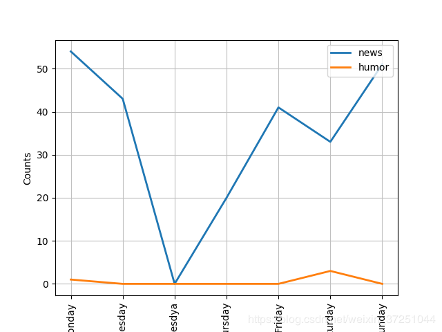
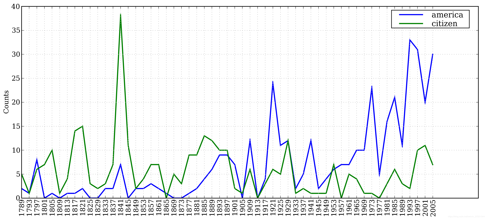
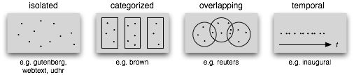
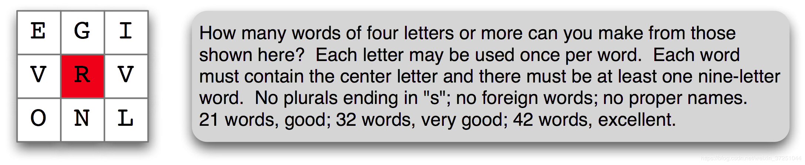

原文在线阅读：https://usyiyi.github.io/nlp-py-2e-zh/2.html
# 1 获取文本语料库
## 1.1 古腾堡语料库
```py
>>> for fileid in gutenberg.fileids():
>...     num_words = len(gutenberg.words(fileid))
>...     num_vocab = len(set(w.lower() for w in gutenberg.words(fileid)))
>...     num_sents = len(gutenberg.sents(fileid))
>...     num_chars = len(gutenberg.raw(fileid))
>...     print("平均词长：", round(num_chars/num_words), "平均句长：", round(num_words/num_sents), "每个单词出现的平均次数：", round(num_words/num_vocab), fileid)
... 
平均词长： 5 平均句长： 25 每个单词出现的平均次数： 26 austen-emma.txt
平均词长： 5 平均句长： 26 每个单词出现的平均次数： 17 austen-persuasion.txt
平均词长： 5 平均句长： 28 每个单词出现的平均次数： 22 austen-sense.txt
平均词长： 4 平均句长： 34 每个单词出现的平均次数： 79 bible-kjv.txt
平均词长： 5 平均句长： 19 每个单词出现的平均次数： 5 blake-poems.txt
平均词长： 4 平均句长： 19 每个单词出现的平均次数： 14 bryant-stories.txt
平均词长： 4 平均句长： 18 每个单词出现的平均次数： 12 burgess-busterbrown.txt
平均词长： 4 平均句长： 20 每个单词出现的平均次数： 13 carroll-alice.txt
平均词长： 5 平均句长： 20 每个单词出现的平均次数： 12 chesterton-ball.txt
平均词长： 5 平均句长： 23 每个单词出现的平均次数： 11 chesterton-brown.txt
平均词长： 5 平均句长： 18 每个单词出现的平均次数： 11 chesterton-thursday.txt
平均词长： 4 平均句长： 21 每个单词出现的平均次数： 25 edgeworth-parents.txt
平均词长： 5 平均句长： 26 每个单词出现的平均次数： 15 melville-moby_dick.txt
平均词长： 5 平均句长： 52 每个单词出现的平均次数： 11 milton-paradise.txt
平均词长： 4 平均句长： 12 每个单词出现的平均次数： 9 shakespeare-caesar.txt
平均词长： 4 平均句长： 12 每个单词出现的平均次数： 8 shakespeare-hamlet.txt
平均词长： 4 平均句长： 12 每个单词出现的平均次数： 7 shakespeare-macbeth.txt
平均词长： 5 平均句长： 36 每个单词出现的平均次数： 12 whitman-leaves.txt
>>> 

```
这个程序显示每个文本的三个统计量：**平均词长**、**平均句子长度**和本文中每个词出现的平均次数（我们的**词汇多样性**得分）。请看，平均词长似乎是英语的一个一般属性，因为它的值总是4。（事实上，平均词长是3而不是4，因为num_chars变量计数了空白字符。）相比之下，平均句子长度和词汇多样性看上去是作者个人的特点。

## 1.2 网络和聊天文本

## 1.3 布朗语料库
```py
>>> from nltk.corpus import brown
>>> news_text = brown.words(categories='news')
>>> fdist = nltk.FreqDist(w.lower() for w in news_text)
>>> for k in fdist:
...     if k[:2] == "wh":
...             print(k + ":",fdist[k],  end = " ")
... 
which: 245 when: 169 who: 268 whether: 18 where: 59 what: 95 while: 55 why: 14 whipped: 2 white: 57 whom: 8 whereby: 3 whole: 11 wherever: 1 whose: 22 wholesale: 1 wheel: 4 whatever: 2 whipple: 1 whitey: 1 whiz: 2 whitfield: 1 whip: 2 whirling: 1 wheeled: 2 whee: 1 wheeler: 2 whisking: 1 wheels: 1 whitney: 1 whopping: 1 wholly-owned: 1 whims: 1 whelan: 1 white-clad: 1 wheat: 1 whites: 2 whiplash: 1 whichever: 1 what's: 1 wholly: 1 >>>  
```


布朗语料库查看一星期各天在news和humor类别语料库的出现的条件下的频率分布：
```py
>>> cfd = nltk.ConditionalFreqDist((genre, word) for genre in brown.categories() for word in brown.words(categories = genre))
>>> genres = ["news", "humor"] # 填写我们想要展示的种类
>>> day = ["Monday", "Tuesday", "Wednesday", "Thursday", "Friday", "Saturday", "Sunday"]
           # 填写我们想要统计的词
>>> cfd.tabulate(conditions = genres, samples = day)
         Monday   Tuesday Wednesday  Thursday    Friday  Saturday    Sunday 
 news        54        43        22        20        41        33        51 
humor         1         0         0         0         0         3         0 
>>> cfd.plot(conditions = genres, samples = day)
```

## 1.4 路透社语料库
## 1.5 就职演说语料库
```py
>>> cfd = nltk.ConditionalFreqDist(
...           (target, fileid[:4])
...           for fileid in inaugural.fileids()
...           for w in inaugural.words(fileid)
...           for target in ['america', 'citizen']
...           if w.lower().startswith(target)) [1]
>>> cfd.plot()

```


条件频率分布图：计数就职演说语料库中所有以america 或citizen开始的词。

## 1.6 标注文本语料库
## 1.8 文本语料库的结构
文本语料库的常见结构：最简单的一种语料库是一些孤立的没有什么特别的组织的文本集合；一些语料库按如文体（布朗语料库）等分类组织结构；一些分类会重叠，如主题类别（路透社语料库）；另外一些语料库可以表示随时间变化语言用法的改变（就职演说语料库）。



## 1.9 加载你自己的语料库
```py
>>> from nltk.corpus import PlaintextCorpusReader
>>> corpus_root = '/usr/share/dict' 
>>> wordlists = PlaintextCorpusReader(corpus_root, '.*') 
>>> wordlists.fileids()
['README', 'connectives', 'propernames', 'web2', 'web2a', 'words']
>>> wordlists.words('connectives')
['the', 'of', 'and', 'to', 'a', 'in', 'that', 'is', ...]
```
# 2 条件频率分布
## 2.1 条件和事件
每个**配对pairs**的形式是：(条件, 事件)。如果我们按文体处理整个布朗语料库，将有15 个条件（每个文体一个条件）和1,161,192 个事件（每一个词一个事件）。
```py
>>> text = ['The', 'Fulton', 'County', 'Grand', 'Jury', 'said', ...] 
>>> pairs = [('news', 'The'), ('news', 'Fulton'), ('news', 'County'), ...]
```
## 2.2 按文体计数词汇
```py
>>> genre_word = [(genre, word) 
...               for genre in ['news', 'romance'] 
...               for word in brown.words(categories=genre)] 
>>> len(genre_word)
170576
>>> genre_word[:4]
[('news', 'The'), ('news', 'Fulton'), ('news', 'County'), ('news', 'Grand')] # [_start-genre]
>>> genre_word[-4:]
[('romance', 'afraid'), ('romance', 'not'), ('romance', "''"), ('romance', '.')] # [_end-genre]

```
```py
>>> cfd = nltk.ConditionalFreqDist(genre_word)
>>> cfd [1]
<ConditionalFreqDist with 2 conditions>
>>> cfd.conditions()
['news', 'romance'] # [_conditions-cfd]
```
```py
>>> print(cfd['news'])
<FreqDist with 14394 samples and 100554 outcomes>
>>> print(cfd['romance'])
<FreqDist with 8452 samples and 70022 outcomes>
>>> cfd['romance'].most_common(20)
[(',', 3899), ('.', 3736), ('the', 2758), ('and', 1776), ('to', 1502),
('a', 1335), ('of', 1186), ('``', 1045), ("''", 1044), ('was', 993),
('I', 951), ('in', 875), ('he', 702), ('had', 692), ('?', 690),
('her', 651), ('that', 583), ('it', 573), ('his', 559), ('she', 496)]
>>> cfd['romance']['could']
193
```


## 2.3 绘制分布图和分布表
见： **1.3 布朗语料库**

## 2.4 使用双连词生成随机文本

利用bigrams制作生成模型：
```py
>>> def generate_model(cfdist, word, num = 15):
...     for i in range(num):
...             print (word,end = " ")
...             word = cfdist[word].max()
... 

>>> text = nltk.corpus.genesis.words("english-kjv.txt")
>>> bigrams = nltk.bigrams(text)
>>> cfd = nltk.ConditionalFreqDist(bigrams)
>>> cfd
<ConditionalFreqDist with 2789 conditions>
>>> list(cfd)
[('they', 'embalmed'), ('embalmed', 'him'), ('him', ','), (',', 'and'), ('and', 'he'), ('he', 'was'), ('was', 'put'), ('put', 'in'), ('in', 'a'), ('a', 'coffin'), ('coffin', 'in'), ('in', 'Egypt'), ('Egypt', '.')]


>>> cfd["so"]
FreqDist({'that': 8, '.': 7, ',': 4, 'the': 3, 'I': 2, 'doing': 2, 'much': 2, ':': 2, 'did': 1, 'Noah': 1, ...})
>>> cfd["living"]
FreqDist({'creature': 7, 'thing': 4, 'substance': 2, 'soul': 1, '.': 1, ',': 1})

>>> generate_model(cfd, "so")
so that he said , and the land of the land of the land of 
>>> generate_model(cfd, "living")
living creature that he said , and the land of the land of the land 
>>> 

```

# 4 词汇资源
## 4.1 词汇列表语料库
**词汇语料库**是Unix 中的/usr/share/dict/words文件，被一些拼写检查程序使用。我们可以用它来寻找文本语料中不寻常的或拼写错误的词汇。
```py
def unusual_words(text):
    text_vocab = set(w.lower() for w in text if w.isalpha())
    english_vocab = set(w.lower() for w in nltk.corpus.words.words())
    unusual = text_vocab - english_vocab
    return sorted(unusual)

>>> unusual_words(nltk.corpus.gutenberg.words('austen-sense.txt'))
['abbeyland', 'abhorred', 'abilities', 'abounded', 'abridgement', 'abused', 'abuses',
'accents', 'accepting', 'accommodations', 'accompanied', 'accounted', 'accounts',
'accustomary', 'aches', 'acknowledging', 'acknowledgment', 'acknowledgments', ...]
>>> unusual_words(nltk.corpus.nps_chat.words())
['aaaaaaaaaaaaaaaaa', 'aaahhhh', 'abortions', 'abou', 'abourted', 'abs', 'ack',
'acros', 'actualy', 'adams', 'adds', 'adduser', 'adjusts', 'adoted', 'adreniline',
'ads', 'adults', 'afe', 'affairs', 'affari', 'affects', 'afk', 'agaibn', 'ages', ...]
```

**停用词语料库**，就是那些高频词汇，如the，to和also，我们有时在进一步的处理之前想要将它们从文档中过滤。
```py
>>> from nltk.corpus import stopwords
>>> stopwords.words('english')
['i', 'me', 'my', 'myself', 'we', 'our', 'ours', 'ourselves', 'you', 'your', 'yours',
'yourself', 'yourselves', 'he', 'him', 'his', 'himself', 'she', 'her', 'hers',
'herself', 'it', 'its', 'itself', 'they', 'them', 'their', 'theirs', 'themselves',
'what', 'which', 'who', 'whom', 'this', 'that', 'these', 'those', 'am', 'is', 'are',
'was', 'were', 'be', 'been', 'being', 'have', 'has', 'had', 'having', 'do', 'does',
'did', 'doing', 'a', 'an', 'the', 'and', 'but', 'if', 'or', 'because', 'as', 'until',
'while', 'of', 'at', 'by', 'for', 'with', 'about', 'against', 'between', 'into',
'through', 'during', 'before', 'after', 'above', 'below', 'to', 'from', 'up', 'down',
'in', 'out', 'on', 'off', 'over', 'under', 'again', 'further', 'then', 'once', 'here',
'there', 'when', 'where', 'why', 'how', 'all', 'any', 'both', 'each', 'few', 'more',
'most', 'other', 'some', 'such', 'no', 'nor', 'not', 'only', 'own', 'same', 'so',
'than', 'too', 'very', 's', 't', 'can', 'will', 'just', 'don', 'should', 'now']
```

**一个字母拼词谜题**：在由随机选择的字母组成的网格中，选择里面的字母组成词；这个谜题叫做“目标”。

```py
>>> puzzle_letters = nltk.FreqDist('egivrvonl')
 # 注意，这里如果是字符串'egivrvonl'的话，给出的就是每个字母的频数
>>> obligatory = 'r'
>>> wordlist = nltk.corpus.words.words()
>>> [w for w in wordlist if len(w) >= 6 
...                      and obligatory in w 
...                      and nltk.FreqDist(w) <= puzzle_letters] 
['glover', 'gorlin', 'govern', 'grovel', 'ignore', 'involver', 'lienor',
'linger', 'longer', 'lovering', 'noiler', 'overling', 'region', 'renvoi',
'revolving', 'ringle', 'roving', 'violer', 'virole']
```

**名字语料库**，包括8000个按性别分类的名字。男性和女性的名字存储在单独的文件中。让我们找出同时出现在两个文件中的名字，即性别暧昧的名字：
```py
>>> names = nltk.corpus.names
>>> names.fileids()
['female.txt', 'male.txt']
>>> male_names = names.words('male.txt')
>>> female_names = names.words('female.txt')
>>> [w for w in male_names if w in female_names]
['Abbey', 'Abbie', 'Abby', 'Addie', 'Adrian', 'Adrien', 'Ajay', 'Alex', 'Alexis',
'Alfie', 'Ali', 'Alix', 'Allie', 'Allyn', 'Andie', 'Andrea', 'Andy', 'Angel',
'Angie', 'Ariel', 'Ashley', 'Aubrey', 'Augustine', 'Austin', 'Averil', ...]
```
## 4.2 发音的词典
## 4.3 比较词表
## 4.4 词汇工具：Shoebox和Toolbox
# 5 WordNet

